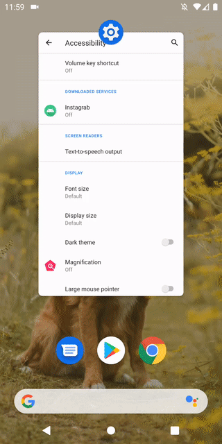

Используется Accessibility API (AccessibilityService). 
В стороннем приложении происходит нажатие кнопки для перехода в профиль пользователя и полученние текста из TextView. 
Результат записывается в БД SQLite и реактивно отображается в приложении (используются Room, ViewModel, Coroutines+Flow)